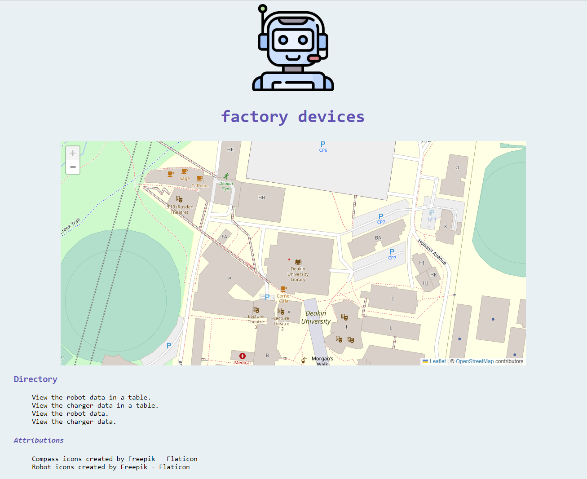
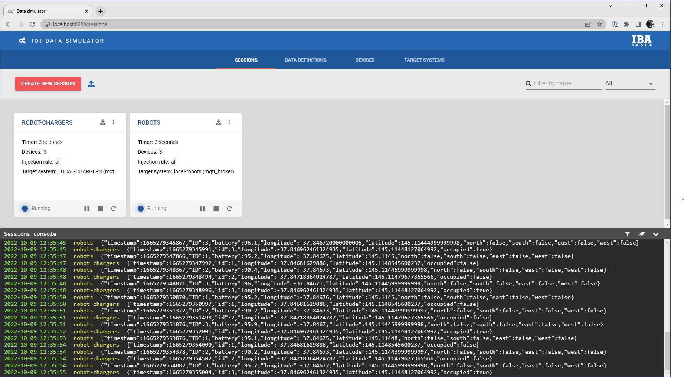
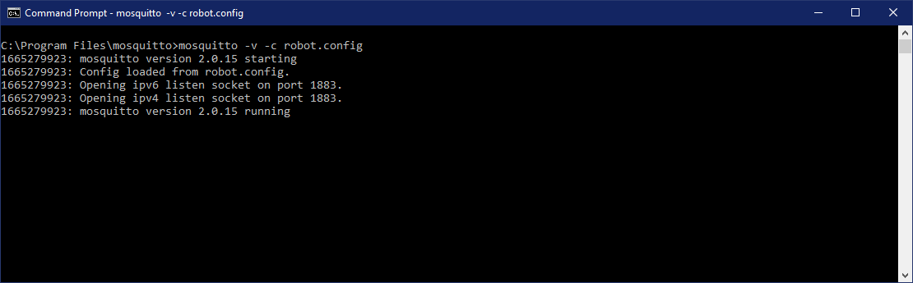
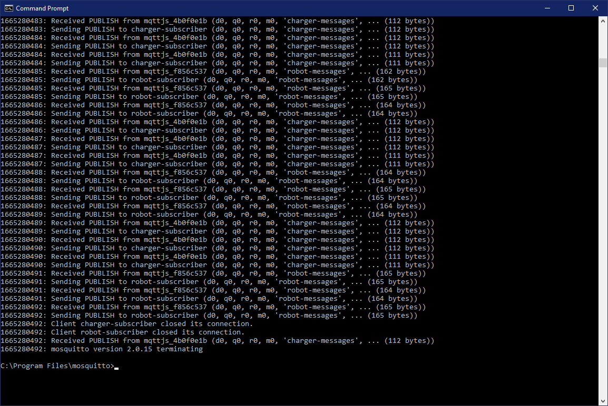
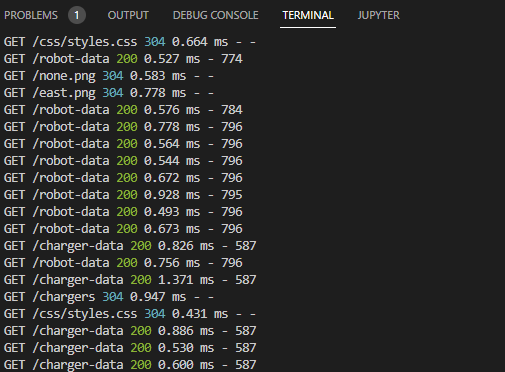

# Factory robots
Final project - web app processing data from industrial IoT data simulator

[Demo video](https://youtu.be/ekibS9rau40)

### Solution design
IoT data is simulated for industrial devices (factory robots and their battery chargers) using a simulation container. This data is passed via MQTT into a web application, where data is published to APIs. The web application allows the users to view the data for all devices. Node.js's asynchronous runtime provides concurrency when handling the many connections to the device groups, and the different devices within each group.

### Solution implementation

#### IoT data simulation

The simulator tool is done using this [IoT data simulator](https://github.com/IBA-Group-IT/IoT-data-simulator), using a schemaless approach to simulate realistic data changes.

- IoT-data-processing-robots.js is the method to create robot data
- IoT-data-processing-chargers.js is the method to create robot charger data

When running, the simulator simultaneously publishes data from both sources, at an interval of 3 seconds.

#### MQTT broker
The MQTT broker [^1] uses Mosquitto run on the local machine. The simulator publishes data, with a different topic used for each type of data.

The broker then sends the messages to the subscribers located in the Node.js application.

#### Node.js server

Node.js is single-threaded, but is capable of placing non-blocking operations into its Event Loop allowing it to switch back and forth between operations asynchronously. This allows it to perform multiple I/O operations concurrently.

The user is able to view the data at the following endpoints:
- /robots for the robot devices
- /chargers for the charging devices

The JSON data is available at /robot-data and /charger-data respectively.

The user endpoints use asynchronous requests to the data endpoint to update the GUI every second. Since these requests are nonblocking, the application can scale up without having a data intensive request slowing the entire system down.

#### Subscription data

The server uses the `mqtt` package to subscribe to the broker. A different client is used for each topic. Upon receiving a message from the MQTT publisher, an event is emitted which updates the data. Since this is a prototype, there is no database (an array on the server is used instead). This updated datasource is available at the endpoints via GET.

### GUI

The user is able to visualise the data in tables at the endpoints, and on a Leaflet map on the homepage. For the purposes of this prototype, the factory premises are imagined to be approximately located where Deakin library is in Burwood.

The robot data table uses an icon to display when the proximity alarm fires.

On the map the robot icons move across the map to indicate where the robots are. The charger markers indicate when the charger is in use.

There is no logic to actually control the devices, this GUI simply displays the data to the user.

### Evaluation

To evaluate performance of the application the frequency of requests was increased from the IoT data simulator and the response time averaged over 10 readings was put in the table below. The logging API `morgan` was used, giving logs of requests with response times and content length.

The number of devices (robot and battery charger) were also increased progressively. All times are in milliseconds unless otherwise given.

| No of robot devices | No of charger devices | Frequency | Response time (index, GET) | Response time (robot-data, GET) | Response time (charger data, GET) |
| ----------- | ----------- | ----------- | ----------- |----------- | ----------- |
| 0 | 0 | - | 1.467 | 0.823 | 0.630 |
| 1 | 1 | 3 secs | 1.587 | 0.756 | 1.319 |
| 1 | 1 | 1 secs | 1.164 | 0.624 | 1.376 |
| 2 | 2 | 3 secs | 1.669 | 0.479 | 1.221 |
| 2 | 2 | 1 secs | 1.454 | 0.738 | 0.825 |
| 3 | 3 | 3 secs | 1.531 | 0.690 | 0.581 |
| 3 | 3 | 1 secs | 0.687 | 0.507 | 0.621 |
| 4 | 3 | 3 secs | 1.133 | 0.938 | 0.594 |
| 4 | 3 | 1 secs | 1.542 | 0.537 | 0.418 |
| 5 | 3 | 3 secs | 1.253 | 0.510 | 0.638 |
| 5 | 3 | 1 secs | 1.273 | 0.570 | 0.887 |
| 5 | 3 | 500 | 1.352 | 0.544 | 0.600 |
| 5 | 3 | 200 | 1.268 | 0.508 | 0.649 |
| 5 | 3 | 100 | 1.421 | 0.598 | 0.682 |

The app did not slow down when the frequency increased, or when the devices increased. This means a frequency of data injection could be chosen based on providing a smooth experience for the user.

---

[^1]: Created using the guide [here](https://www.youtube.com/watch?v=DH-VSAACtBk).
